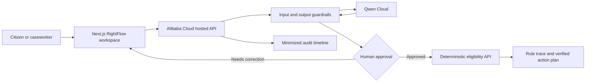

# Architecture

## Failure model

| Failure | Deterministic response |
|---|---|
| Missing Qwen key | Labelled demo extractor; no AI claim |
| Qwen timeout or non-2xx | Same fail-closed demo path |
| Invalid Qwen JSON | Reject output; demo path |
| Unknown fact key | Reject complete Qwen payload |
| Prompt injection text | Treat as case content and flag guardrail event |
| Missing required facts | Stop with `NEEDS_INFORMATION` |
| No human approval | Eligibility tool remains unavailable |
